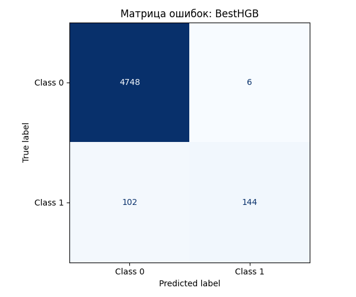

# HW06 – Report

> Файл: `homeworks/HW06/report.md`  
> Важно: не меняйте названия разделов (заголовков). Заполняйте текстом и/или вставляйте результаты.

## 1. Dataset

- Какой датасет выбран: `S06-hw-dataset-04.csv`
- Размер: 25000 строк, 62 столбца
- Целевая переменная: `target` (0: 0.9508, 1: 0.0492). У таргета сильный дисбаланс, преобладают классы 0.
- Признаки: 60 столбцов-признаков без пропусков типа `float64`

## 2. Protocol

- Разбиение: Данные разделены на обучающую и тестовую выборки в пропорции 80/20 (test_size=0.2) с фиксированным random_state=39 для воспроизводимости результатов.
- Подбор: Использовался метод кросс-валидации на 5 фолдах (cv=5). Оптимизация гиперпараметров проводилась с помощью `GridSearchCV`. Для моделей проводился перебор по сетке (например, глубина дерева `max_depth`, количество объектов в листе `min_samples_leaf` и параметры регуляризации C), после чего модель переобучалась на всей тренировочной выборке (refit=True) с лучшими найденными параметрами.
- Метрики: 
    - `ROC-AUC` (основная, `METRIC="roc_auc"`): Позволяет оценить качество ранжирования объектов и способность модели разделять классы вне зависимости от выбранного порога и дисбаланса. Она показывает не просто "угадал или нет", а насколько хорошо модель отличает типичного представителя одного класса от другого, что критично для несбалансированного таргета.
    - `F1-score`: Необходим для оценки баланса между Precision и Recall, что критично при малом количестве объектов положительного класса.
    - `Precision`: Показывает долю реальных объектов класса 1 среди всех, которые модель пометила как 1 (важно для минимизации FP).
    - `Recall`: Отражает способность модели находить объекты положительного класса (важно для минимизации FN).
    - `Accuracy`: Процент общего количества правильных предсказаний.
    - `Confusion Matrix`: Прямой подсчет ошибок каждого типа.

## 3. Models

Для каждой модели (кроме DummyClassifier) проводилась оптимизация гиперпараметров с помощью GridSearchCV.

- `DummyClassifier` (baseline): Использована стратегия `most_frequent` (предсказывает самый частовстречающийся класс). Данная модель служит для оценки «порога случайного угадывания»
- `LogisticRegression`: Линейная модель, выступающая в роли бейзлайна. В рамках оптимизации перебирались сила регуляризации (`C`) в диапазоне [0.001, 0.01, 0.1, 1, 10, 100] и `solver` между [`liblinear`, `lbfgs`].
- `DecisionTreeClassifier`: Одиночное дерево решений, использованное для оценки линейной разделимости признаков. Регулировались максимальная глубина дерева `max_depth` ([3, 5, 10, 20]) и минимальное количество объектов в листе `min_samples_leaf` ([5, 10, 20]).
- RandomForestClassifier: подбирались `max_depth` ([10, 25, 50]) и `min_samples_leaf` ([1, 5, 10]).
- `HistGradientBoostingClassifier`: градиентный бустинг. Перебирались `max_depth` ([5, 25, 50]) и `min_samples_leaf` ([10, 25, 50]).

## 4. Results

- Сводная таблица метрик на test-выборке по всем моделям (сортировка по `ROC-AUC`, `RANDOM_STATE=39`):

| Model | accuracy | precision | recall | f1 | roc_auc | TN | FP | FN | TP |
|  :---  |  ---:  |  ---:  |  ---:  |  ---:  |  ---:  |  ---:  |  ---:  |  ---:  |  ---:  |
| HistGradientBoosting | 0.9784 | 0.9600 | 0.5854 | 0.7273 | 0.8936 | 4748.0000 | 6.0000 | 102.0000 | 144.0000 |
| RandomForest | 0.9702 | 0.9709 | 0.4065 | 0.5731 | 0.8845 | 4751.0000 | 3.0000 | 146.0000 | 100.0000 |
| LogisticRegression | 0.9528 | 1.0000 | 0.0407 | 0.0781 | 0.8461 | 4754.0000 | 0.0000 | 236.0000 | 10.0000 |
| DecisionTree | 0.9684 | 0.8284 | 0.4512 | 0.5842 | 0.8257 | 4731.0000 | 23.0000 | 135.0000 | 111.0000 |
| DummyClassifier | 0.9508 | 0.0000 | 0.0000 | 0.0000 | 0.5000 | 4754.0000 | 0.0000 | 246.0000 | 0.0000 |

- Победитель `HistGradientBoostingClassifier` по метрике `ROC-AUC`. Модель показала наилучшую разделительную способность (ROC-AUC = 0.8936). Бустинг успешно справился с поиском объектов меньшего класса (1), обеспечив максимальный Recall (0.5854) при сохранении высокой точности (Precision 0.96). Это подтверждается самой лучшей среди других моделей метрикой F1-score (0.7273), что делает данную модель наиболее эффективной для работы с текущим дисбалансом данных.

## 5. Analysis

- Анализ устойчивости моделей к изменению `random_state` (39, 42, 12, 74, 77). Все модели сохраняют относительный порядок качества в разных запусках: `HistGradientBoosting` > `RandomForest`  > `LogisticRegression` > `DecisionTree` > `DummyClassifier`. Изменение random_state не меняет общую картину: сложные ансамблевые методы превосходят простые. `HistGradientBoosting` по всем метрикам разброс является минимальным среди других моделей и не превосходит +- 0.05, при этом оставаясь наилучшей моделью по метрике `ROC-AUC`. Таким образом, самой оптимальной и устойчивой моделью на текущем датасете будет `HistGradientBoosting `.

- Ошибки: подобранная лучшая модель демонстрирует отличную точность (`Precision`), допуская всего 6 ложноположительных срабатываний (FP), однако на 102-х объектах произошло ложноотрицательное срабатывание (FN). 

- Интерпретация: признаки `f54`, `f25` и `f11` являются наиболее важными для модели. Их перемешивание приводит к значимому падению `ROC-AUC`, что указывает на их сильную связь с целевой переменной. Эти признаки составляют основу прогнозной способности модели

| feature | importance_mean | importance_std | importance_rank |
|---------|-----------------|----------------|-----------------|
| f54     | 0.028218        | 0.003392       | 22              |
| f25     | 0.019193        | 0.003016       | 51              |
| f11     | 0.011136        | 0.002670       | 47              |
| f58     | 0.009786        | 0.002361       | 46              |
| f04     | 0.008522        | 0.002312       | 58              |
| f41     | 0.007731        | 0.004261       | 34              |
| f13     | 0.006073        | 0.003403       | 36              |
| f53     | 0.005710        | 0.003475       | 43              |
| f33     | 0.005309        | 0.003690       | 20              |
| f08     | 0.004293        | 0.002612       | 53              |
| f47     | 0.002998        | 0.004121       | 42              |
| f15     | 0.002950        | 0.001359       | 9               |
| f36     | 0.002587        | 0.001393       | 37              |
| f30     | 0.001984        | 0.000933       | 23              |
| f09     | 0.001924        | 0.001177       | 33              |

## 6. Conclusion

Эксперимент показал, что ансамблевые методы (особенно бустинг) существенно превосходят одиночные деревья и линейные модели при работе с сильно несбалансированными данными. Правильный выбор метрик оказался критически важным для объективной оценки моделей, поскольку обычная точность (`Accuracy`) в таких условиях даёт искажённую картину.

Анализ устойчивости подтвердил надёжность полученных результатов: изменение `random_state` не меняет общего порядка эффективности моделей. Наилучшей на данном датасете остается `HistGradientBoosting`.

Метод перемешивания признаков (permutation importance) позволил выявить наиболее значимые признаки и установить их связь с таргетом, что делает сложную ансамблевую модель более интерпретируемой.

Таким образом, данная работа подчеркивает важность соблюдения строгого ML-протокола — от корректного выбора метрик до анализа устойчивости и интерпретируемости моделей, что в итоге гарантирует получение надёжных и обоснованных результатов.